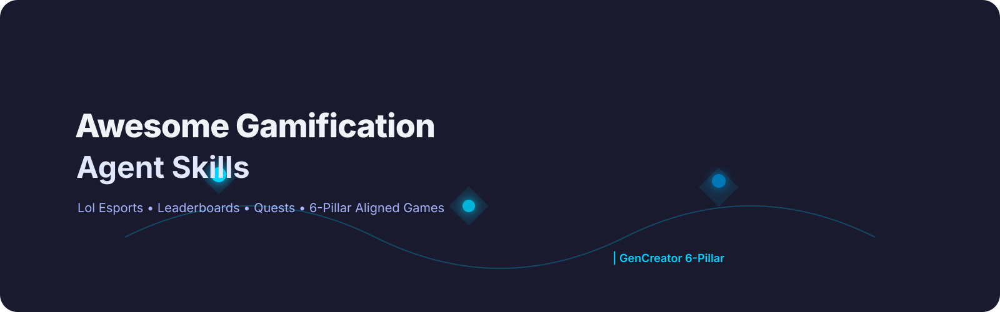
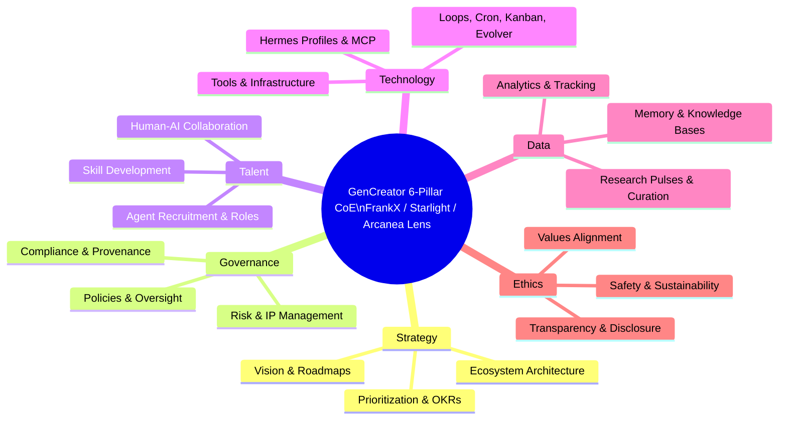

  

<h1 align="center">Awesome Gamification Agent Skills</h1>

  <strong>Curated through the GenCreator 6-Pillar CoE lens • Starlight Swarm • Arcanea Creative Execution • Agentic Passive Income Systems</strong>

  <a href="#contents">Contents</a> ·
  <a href="#6-pillar-mapping">6-Pillar Mapping</a> ·
  <a href="#explore-the-full-frankx-awesome-ecosystem-17-lists">Full Ecosystem (17)</a> ·
  <a href="#contributing">Contribute</a>

> **THE definitive curated resource for gamification-agent-skills** — Leaderboards, quests, progression systems, esports agents, lol-esports-llm-agents, MCP gamification servers, and agentic mastery loops. 6-Pillar aligned for talent development and income.

## Why This List Exists
Gamification drives engagement, skill development (Talent pillar), and recurring income through agentic systems. Integrates with lol-esports-llm-agents and agentic-passive-income.

## Contents
- [Top Picks](#top-picks)
- [Core Gamification Frameworks](#core-gamification-frameworks)
- [Esports & Competitive Agents](#esports--competitive-agents)
- [MCP & Agent Skills](#mcp--agent-skills)
- [Agentic Passive Income & Loops](#agentic-passive-income--loops)
- [6-Pillar Mapping](#6-pillar-mapping)
- [Explore the Full FrankX Awesome Ecosystem (17+ Lists)](#explore-the-full-frankx-awesome-ecosystem-17-lists)
- [Contributing](#contributing)

## Top Picks
| Category | Recommended | 6-Pillar Fit |
|----------|-------------|--------------|
| Esports | lol-esports-llm-agents | Talent + Technology |
| Progression | Custom quest agents | Talent + Governance |
| Income | Mastery loop agents | Income pillar |

## Core Gamification Frameworks
- Leaderboard systems, XP/levels, badges, quests, achievements.
- Integration with kanban-orchestrator and kanban-worker for agent progression tracking.
- **lol-esports-llm-agents** skill – Curated research on League of Legends AI agents, LLM-powered esports analysis (load via skill_view).

## Esports & Competitive Agents
- LLM agents for match analysis, strategy, real-time coaching.
- Gamified agent training environments.
- Cross with gamification in wealth/investor for simulated trading games.

## MCP & Agent Skills
- gstack gamification skills.
- Hermes integration for multi-agent game masters and player agents.

## Agentic Passive Income & Loops
- Gamified skill marketplaces, subscription mastery programs, tournament agents.
- Load skill_view(name='agentic-passive-income')

## 6-Pillar Mapping

## Explore the Full FrankX Awesome Ecosystem (17+ Lists)
Curated through the GenCreator 6-Pillar CoE lens • Starlight Swarm • Arcanea Creative Execution • Agentic Passive Income Systems

- [awesome-jarvis](https://github.com/frankxai/awesome-jarvis)
- [awesome-manifestation-skills](https://github.com/frankxai/awesome-manifestation-skills)
- [awesome-agentic-income](https://github.com/frankxai/awesome-agentic-income)
- [awesome-hermes-agents](https://github.com/frankxai/awesome-hermes-agents)
- [awesome-ai-coe](https://github.com/frankxai/awesome-ai-coe)
- [awesome-design-agent-skills](https://github.com/frankxai/awesome-design-agent-skills)
- [awesome-music-agent-skills](https://github.com/frankxai/awesome-music-agent-skills)
- [awesome-agent-operating-systems](https://github.com/frankxai/awesome-agent-operating-systems)
- [awesome-hermes-agent-skills](https://github.com/frankxai/awesome-hermes-agent-skills)
- [awesome-wealth-agent-skills](https://github.com/frankxai/awesome-wealth-agent-skills)
- [awesome-gamification-agent-skills](https://github.com/frankxai/awesome-gamification-agent-skills) ← You are here
- [awesome-investor-agent-skills](https://github.com/frankxai/awesome-investor-agent-skills)
- [awesome-automation-agent-skills](https://github.com/frankxai/awesome-automation-agent-skills)
- [awesome-cosmos-ai-agents](https://github.com/frankxai/awesome-cosmos-ai-agents)
- [awesome-mind-agent-skills](https://github.com/frankxai/awesome-mind-agent-skills)
- [awesome-payment-agent-skills](https://github.com/frankxai/awesome-payment-agent-skills)
- [awesome-motion-design-agent-skills](https://github.com/frankxai/awesome-motion-design-agent-skills)

## Contributing
Follow [CONTRIBUTING.md](CONTRIBUTING.md) and provenance from awesome-hermes-agents. Add 6-Pillar Fit and source. Use issue templates.

**Maintenance**: Updated via awesome-list-maintenance skill + gencreator-swarm-evolver. Last research pulse: 2026-07-01

*Elevated with patched template: mermaid 6-pillar, 17-list cross links, hero.svg, .github/ standards, gh topics/description. Verified with gh/git.*
